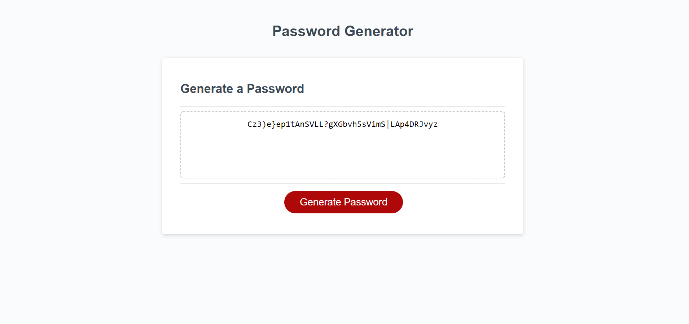

# Password Generator Starter Code
Here are the files for the Password Generator which I got working.

URL - https://thomburt.github.io/pw-generator/ (Links to an external site.)

 

GitHub Repo - https://github.com/ThomBurt/pw-generator

- I started out with the possible character, which are seperated into their own unique variable. upperCase, lowerCase, numbers, specialCharacters

- I then created a new 'getPasswordRequirements function, which I used to store the questions.

-using parseInt I changed the 'How many characters would you like' question string into a number.

- the 'confirm' declaration is used to get a yes or no answer for all of the questions that ask the user whether or not they want that specific character to be included within the password.

- to be sure that at least 1 password criteria was met, I used an 'if' statement, to say that if all the criteria came back with the boolean statement as false (meaning no in this situation), then an alert will show telling them to select at least one criteria.

- I then used an object to store all of the pw criteria, and returned it.

- then I moved onto the setting parameters for the getPassword function.

- I used a variable requirements within the function that is equal to the getPasswordRequirements function we made earlier.

- the listOfCharacterTypes function holds all of the possible character choices 

- the everyCharacterType function is being used in this situation to basically force the users criteria choice within the password.

- the 'if' statements that follow are all basically saying that if the user selected that specific criteria, to add it to the listOfCharacterTypes variable, and the everCharacterType.push below it, is making sure that at least 1 character from the users criteria selection is being added to the final generated password.

- in the following 'for' statement we are saying that the password we want to generate can be no longer than the promptPWLength variable, which holds the users desired password length.

- to connect all of these decisions to the final generator function, I made a variable named 'answer' and made it equal to the password function, and then joined it together as a string. Then returned it.

- after this I have the getRandom function, which is using math.floor and math.random to calculate random character to be used in the password.

here is the link to the finished generator:
https://thomburt.github.io/pw-generator/

I have included a screenshot within the root folder.
